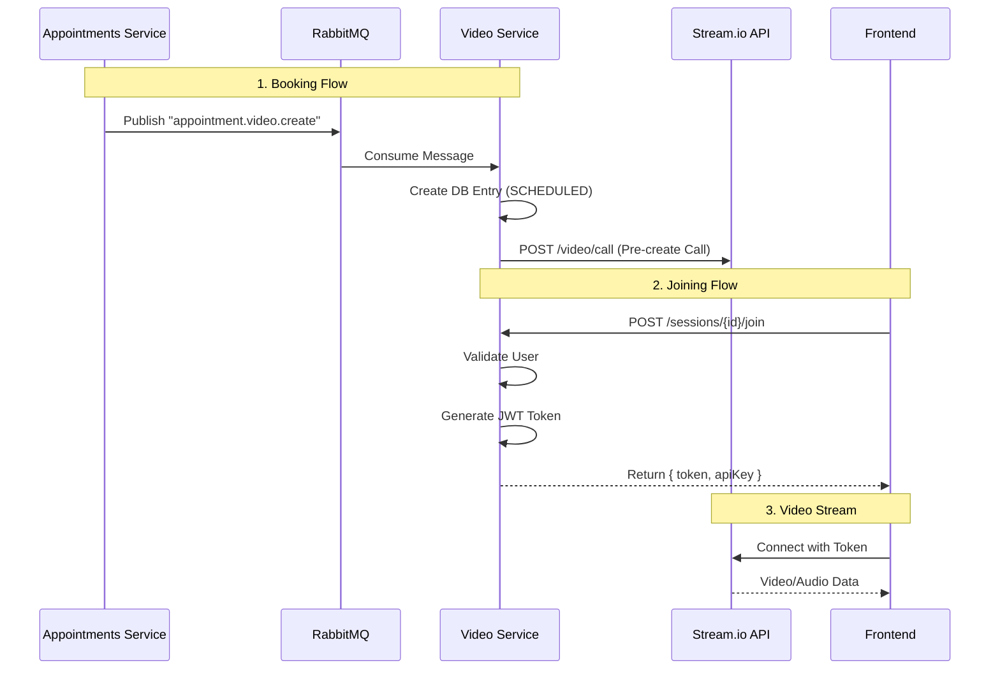

# Video Consultation Architecture & Flow

This document details the complete flow of the video consultation system, explaining how sessions are created, booked, and joined using **Stream.io** as the video provider.

## 1. System Components

- **Appointments Service:** Manages schedule and booking logic. Emits events when appointments are created.
- **Video Consultation Service:** Manages video session lifecycle and integrates with Stream.io.
  - **Database:** Stores session metadata, participant status, and logs.
  - **Stream Manager:** Communicates with Stream.io REST API to create calls and generate JWT tokens.
- **RabbitMQ:** Message broker for asynchronous communication between services.
- **Frontend (Doctor/Patient Apps):** Uses `@stream-io/video-react-sdk` to render video calls.

---

## 2. Session Creation Flow

Sessions are typically created automatically when an appointment is booked.

### Step 1: Appointment Booking

1.  **Patient/Admin** books an appointment via `appointments-service` API.
2.  The appointment is flagged as a video consultation (e.g., `appointment_type="VIDEO"`).
3.  **Appointments Service** publishes a RabbitMQ event: `appointment.video.create`.

### Step 2: Event Consumption (Video Service)

1.  `RabbitMQConsumer` in **Video Consultation Service** receives the message.
2.  It extracts payload: `appointment_id`, `doctor_id`, `patient_id`, `start_time`.
3.  Calls `video_service.create_session(...)`.
    - Creates entry in `video_consultation_sessions` table (Status: `SCHEDULED`).
    - Calls `stream_manager.create_video_session(session_id, ...)` to pre-create the call on Stream.io.

### Step 3: Manual Creation (Alternative)

- **Doctor** can manually create an instant session via `POST /api/video/sessions`.
- Useful for "Dual Mode" where a doctor starts an ad-hoc session.

---

## 3. Joining a Session

This is the flow for **how to view/join a session** from the frontend.

### Step 1: Fetch Session Details

- **Frontend** calls `POST /api/video/sessions/{session_id}/join`.
- **Payload:**
  ```json
  {
    "user_id": "doctor_123",
    "role": "HOST"
  }
  ```

### Step 2: Backend Validation & Token Generation

1.  **Video Service** validates:
    - Does session exist?
    - Is it active (not ENDED)?
    - Is the user an authorized participant?
2.  **Video Service** calls `stream_manager.generate_token(user_id)`.
    - Uses `HS256` signing with `STREAM_API_SECRET`.
3.  **Response:** Returns the `token` and `api_key`.

### Step 3: Frontend Connects

1.  Frontend initializes `StreamVideoClient` with the returned API Key and Token.
2.  Joins the call using `client.call('default', session_id).join()`.

---

## 4. API Endpoints (Video Service)

Base URL: `http://localhost:8004/api/video`

| Method   | Endpoint                 | Description                                      |
| :------- | :----------------------- | :----------------------------------------------- |
| **POST** | `/sessions`              | Manual session creation.                         |
| **POST** | `/sessions/{id}/join`    | **Critical.** Generates Stream Token for a user. |
| **POST** | `/sessions/{id}/end`     | Marks session as COMPLETED in DB.                |
| **GET**  | `/sessions/doctor/{id}`  | List sessions for a doctor.                      |
| **GET**  | `/sessions/patient/{id}` | List sessions for a patient.                     |

---

## 5. Service Communication Diagram



## 6. Development Checklist

1.  **Run Services:** Ensure `appointments-service`, `video-consultation-service`, and RabbitMQ are running.
2.  **Verify Setup:** Run `verify_stream_setup.py` (if available) or check startup logs for "StreamManager initialized".
3.  **Book Appointment:** Use Postman/Curl to book an appointment (sets off the event flow).
4.  **Join:** Use the frontend (Doctor Dashboard) to click "Join Call".

---

## 7. Migration Notes (WebRTC -> Stream)

- Old WebRTC naming conventions (Signal Server, ICE Servers) are **obsolete**.
- All video traffic is now managed by Stream's global edge network.
- Your backend simply acts as a **Token Authority**.
